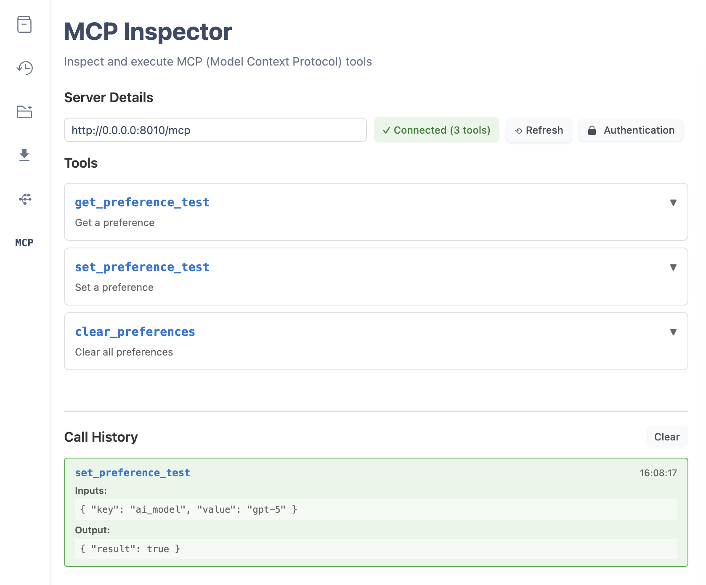

# GraphQL-MCP

[](https://badge.fury.io/py/graphql-mcp)
[](https://pypi.org/project/graphql-mcp/)
[](https://opensource.org/licenses/MIT)

**[📚 Documentation](https://graphql-mcp.parob.com/)** | **[📦 PyPI](https://pypi.org/project/graphql-mcp/)** | **[🔧 GitHub](https://github.com/parob/graphql-mcp)**

---

A library for automatically generating [FastMCP](https://pypi.org/project/fastmcp/) tools from GraphQL APIs using [graphql-api](https://pypi.org/project/graphql-api/).

This allows you to expose your GraphQL API as MCP tools that can be used by AI agents and other systems.

## Quick Start

Install graphql-mcp with graphql-api:

```bash
pip install graphql-mcp graphql-api
```

Create a simple GraphQL API and expose it as MCP tools:

```python
import asyncio
import uvicorn

from graphql_api import GraphQLAPI, field
from graphql_mcp.server import GraphQLMCP


class HelloWorldAPI:

    @field
    def hello(self, name: str = "World") -> str:
        return f"Hello, {name}!"


api = GraphQLAPI(root_type=HelloWorldAPI)

server = GraphQLMCP.from_api(api)

mcp_app = server.http_app(
    transport="streamable-http",
    stateless_http=True
)


if __name__ == "__main__":
    uvicorn.run(mcp_app, host="0.0.0.0", port=8002)
```

That's it! Your GraphQL API is now available as MCP tools.

## Features

- **Automatic Tool Generation**: Converts GraphQL queries and mutations into MCP tools
- **Type-Safe**: Maps GraphQL types to Python types with full type hints
- **Built-in HTTP Server**: Serves both MCP and GraphQL endpoints
- **Authentication**: Supports JWT and bearer token authentication
- **Remote GraphQL**: Connect to existing GraphQL APIs
- **Production Ready**: Built on FastMCP and Starlette
- **Built-in MCP Inspector**: Web-based GraphiQL interface for testing and debugging

## Documentation

**Visit the [official documentation](https://graphql-mcp.parob.com/)** for comprehensive guides, examples, and API reference.

### Key Topics

- **[Getting Started](https://graphql-mcp.parob.com/docs/getting-started/)** - Quick introduction and basic usage
- **[Configuration](https://graphql-mcp.parob.com/docs/configuration/)** - Configure your MCP server
- **[Remote GraphQL](https://graphql-mcp.parob.com/docs/remote-graphql/)** - Connect to existing GraphQL APIs
- **[MCP Inspector](https://graphql-mcp.parob.com/docs/mcp-inspector/)** - Test and debug your tools
- **[Examples](https://graphql-mcp.parob.com/docs/examples/)** - Real-world usage examples
- **[API Reference](https://graphql-mcp.parob.com/docs/api-reference/)** - Complete API documentation

## Integration

GraphQL MCP works with:

- **[graphql-api](https://graphql-api.parob.com/)** - Recommended for building GraphQL APIs
- **[graphql-db](https://graphql-db.parob.com/)** - For database-backed GraphQL APIs
- **[graphql-http](https://graphql-http.parob.com/)** - For HTTP serving alongside MCP
- **Any GraphQL library** that produces a `graphql-core` schema

## How It Works

GraphQL MCP automatically:
- Analyzes your GraphQL schema
- Generates MCP tools from queries and mutations
- Maps GraphQL types to Python types
- Converts naming to `snake_case` (e.g., `addBook` → `add_book`)
- Preserves documentation and type information

See the [documentation](https://graphql-mcp.parob.com/) for detailed guides on remote APIs, authentication, and configuration.

## MCP Inspector

Built-in web interface for testing and debugging MCP tools:



Enable with `graphql_http=True` to access the inspector in your browser. See the [MCP Inspector documentation](https://graphql-mcp.parob.com/docs/mcp-inspector/) for details.

## License

MIT License - see [LICENSE](LICENSE) file for details.
