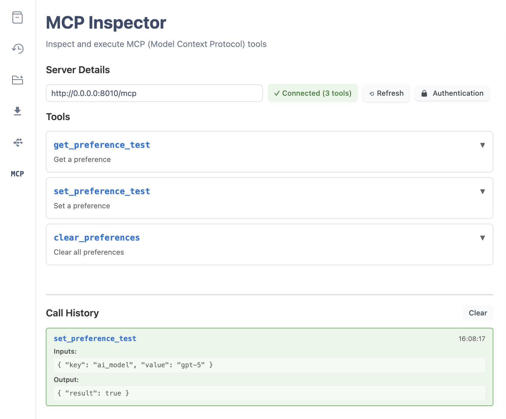

# GraphQL-MCP

[](https://badge.fury.io/py/graphql-mcp)
[](https://pypi.org/project/graphql-mcp/)
[](https://opensource.org/licenses/MIT)

**[📚 Documentation](https://graphql-mcp.com/)** | **[📦 PyPI](https://pypi.org/project/graphql-mcp/)** | **[🔧 GitHub](https://github.com/parob/graphql-mcp)**

---

**Instantly expose any GraphQL API as MCP tools for AI agents and LLMs.**

GraphQL MCP works with **any** Python GraphQL library—Strawberry, Ariadne, Graphene, graphql-core, or [graphql-api](https://graphql-api.parob.com/). If you already have a GraphQL API, you can expose it as MCP tools in minutes.

## Features

- ✅ **Universal Compatibility** - Works with any GraphQL library that produces a `graphql-core` schema
- 🚀 **Automatic Tool Generation** - GraphQL queries and mutations become MCP tools instantly
- 🔌 **Remote GraphQL Support** - Connect to any existing GraphQL endpoint
- 🎯 **Type-Safe** - Preserves GraphQL types and documentation
- 🔧 **Built-in Inspector** - Web interface for testing MCP tools
- 📡 **Multiple Transports** - HTTP, SSE, and streamable-HTTP support

## Installation

```bash
pip install graphql-mcp
```

## Quick Start

### With Strawberry (Popular)

Already using [Strawberry](https://strawberry.rocks/)? Expose it as MCP tools:

```python
import strawberry
from graphql_mcp.server import GraphQLMCP
import uvicorn

@strawberry.type
class Query:
    @strawberry.field
    def hello(self, name: str = "World") -> str:
        return f"Hello, {name}!"

schema = strawberry.Schema(query=Query)

# Expose as MCP tools
server = GraphQLMCP(schema=schema._schema, name="My API")
app = server.http_app()

if __name__ == "__main__":
    uvicorn.run(app, host="0.0.0.0", port=8002)
```

That's it! Your Strawberry GraphQL API is now available as MCP tools.

### With Ariadne

Using [Ariadne](https://ariadnegraphql.org/)? Same simple integration:

```python
from ariadne import make_executable_schema, QueryType
from graphql_mcp.server import GraphQLMCP

type_defs = """
    type Query {
        hello(name: String = "World"): String!
    }
"""

query = QueryType()

@query.field("hello")
def resolve_hello(_, info, name="World"):
    return f"Hello, {name}!"

schema = make_executable_schema(type_defs, query)

# Expose as MCP tools
server = GraphQLMCP(schema=schema, name="My API")
app = server.http_app()
```

### With Graphene

[Graphene](https://graphene-python.org/) user? Works seamlessly:

```python
import graphene
from graphql_mcp.server import GraphQLMCP

class Query(graphene.ObjectType):
    hello = graphene.String(name=graphene.String(default_value="World"))

    def resolve_hello(self, info, name):
        return f"Hello, {name}!"

schema = graphene.Schema(query=Query)

# Expose as MCP tools
server = GraphQLMCP(schema=schema.graphql_schema, name="My API")
app = server.http_app()
```

### With graphql-api (Recommended)

For new projects, we recommend [graphql-api](https://graphql-api.parob.com/) for its decorator-based approach:

```python
from graphql_api import GraphQLAPI, field
from graphql_mcp.server import GraphQLMCP

class API:
    @field
    def hello(self, name: str = "World") -> str:
        return f"Hello, {name}!"

api = GraphQLAPI(root_type=API)
server = GraphQLMCP.from_api(api)
app = server.http_app()
```

## Remote GraphQL APIs

**Already have a GraphQL API running?** Connect to it directly:

```python
from graphql_mcp.server import GraphQLMCP

# Connect to any GraphQL endpoint
server = GraphQLMCP.from_remote_url(
    url="https://api.github.com/graphql",
    bearer_token="your_token",
    name="GitHub API"
)

app = server.http_app()
```

Works with:
- GitHub GraphQL API
- Shopify GraphQL API
- Hasura
- Any public or private GraphQL endpoint

## Examples

The [`examples/`](examples/) directory contains four runnable servers:

| Example | What it demonstrates | Live |
|---------|---------------------|------|
| [Hello World](examples/hello_world.py) | Minimal MCP server with a single query | [Try it](https://examples.graphql-mcp.com/hello-world/) |
| [Task Manager](examples/task_manager.py) | CRUD, enums, mutations, UUID/datetime scalars | [Try it](https://examples.graphql-mcp.com/task-manager/) |
| [Nested API](examples/nested_api.py) | Nested tools, @mcpHidden, Pydantic models, async resolvers | [Try it](https://examples.graphql-mcp.com/nested-api/) |
| [Remote API](examples/remote_api.py) | Wrap a public GraphQL API via `from_remote_url()` | [Try it](https://examples.graphql-mcp.com/remote-api/) |

See the [examples documentation](https://graphql-mcp.com/examples) for detailed walkthroughs.

## Documentation

**Visit the [official documentation](https://graphql-mcp.com/)** for comprehensive guides, examples, and API reference.

### Key Topics

- **[Getting Started](https://graphql-mcp.com/getting-started)** - Quick introduction and basic usage
- **[Configuration](https://graphql-mcp.com/configuration)** - Configure your MCP server
- **[Remote APIs](https://graphql-mcp.com/existing-apis)** - Connect to existing GraphQL APIs
- **[Examples](https://graphql-mcp.com/examples)** - Real-world usage examples
- **[API Reference](https://graphql-mcp.com/api-reference)** - Complete API documentation

## How It Works

GraphQL MCP automatically:
- Analyzes your GraphQL schema
- Generates MCP tools from queries and mutations
- Maps GraphQL types to MCP tool schemas
- Converts naming to `snake_case` (e.g., `addBook` → `add_book`)
- Preserves all documentation and type information
- Supports `@mcpHidden` directive to hide arguments from MCP tools

## MCP Inspector

Built-in web interface for testing and debugging MCP tools:



The inspector is enabled by default — visit `/graphql` in your browser. See the [MCP Inspector documentation](https://graphql-mcp.com/docs/mcp-inspector/) for details.

## Compatibility

GraphQL MCP works with any Python GraphQL library that produces a `graphql-core` schema:

- ✅ **[Strawberry](https://strawberry.rocks/)** - Modern, type-hint based GraphQL
- ✅ **[Ariadne](https://ariadnegraphql.org/)** - Schema-first GraphQL
- ✅ **[Graphene](https://graphene-python.org/)** - Code-first GraphQL
- ✅ **[graphql-api](https://graphql-api.parob.com/)** - Decorator-based GraphQL (recommended)
- ✅ **[graphql-core](https://github.com/graphql-python/graphql-core)** - Reference implementation
- ✅ **Any GraphQL library** using graphql-core schemas

## Ecosystem Integration

- **[graphql-api](https://graphql-api.parob.com/)** - Recommended for building new GraphQL APIs
- **[graphql-db](https://graphql-db.parob.com/)** - For database-backed GraphQL APIs
- **[graphql-http](https://graphql-http.parob.com/)** - For HTTP serving alongside MCP

## Configuration

```python
# Full configuration example
server = GraphQLMCP(
    schema=your_schema,
    name="My API",
    graphql_http=False,         # Disable GraphQL HTTP endpoint (enabled by default)
    allow_mutations=True,       # Allow mutation tools (default)
)

# Serve with custom configuration
app = server.http_app(
    transport="streamable-http",  # or "http" (default) or "sse"
    stateless_http=True,         # Don't maintain client state
)
```

See the [documentation](https://graphql-mcp.com/) for advanced configuration, authentication, and deployment guides.

## License

MIT License - see [LICENSE](LICENSE) file for details.
